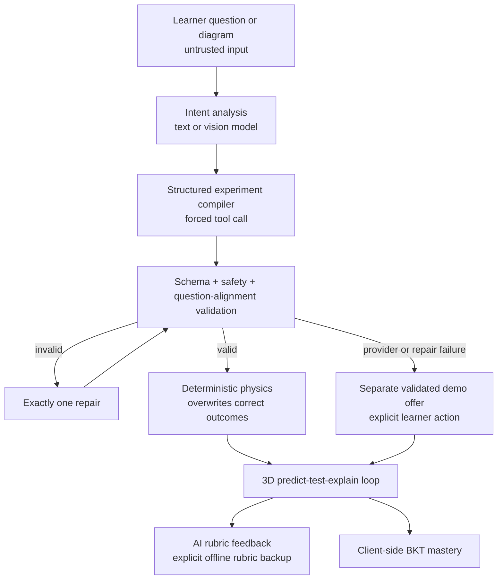
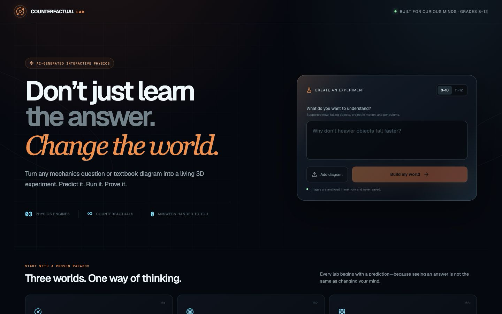
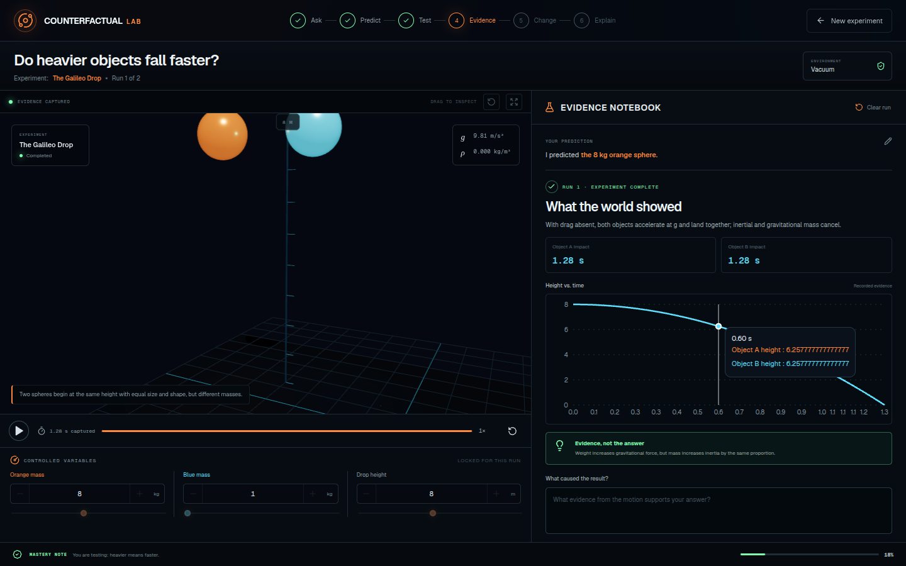
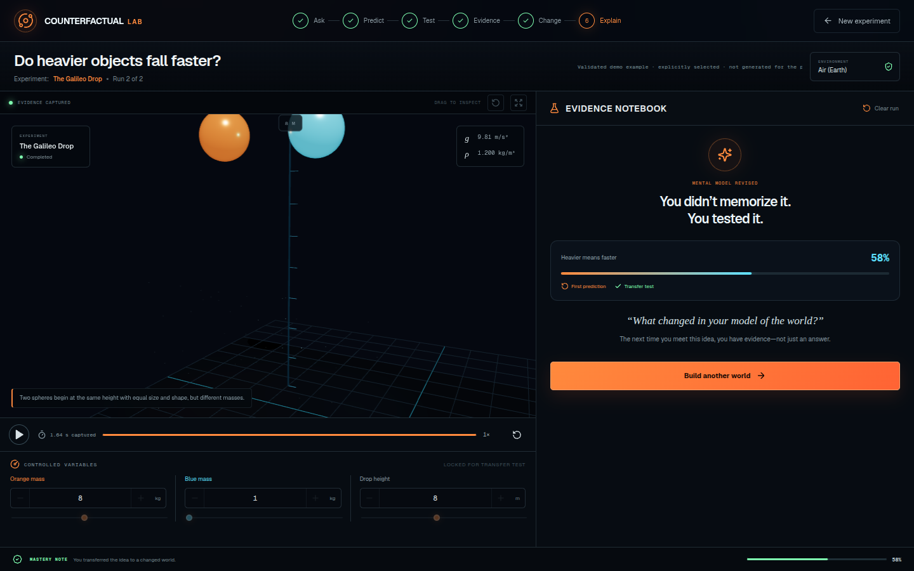

# Counterfactual Lab

**AI tutors explain the world. Counterfactual Lab builds a world you can change.**

## The problem, in 30 seconds

Ask a chatbot whether heavier objects fall faster and it gives you a paragraph.
You can read the correct answer without changing the intuition that produced the
wrong one. Counterfactual Lab turns a typed mechanics question or textbook
diagram into a live 3D experiment. The learner commits to a prediction, watches
the world answer, explains the evidence, and then transfers the idea to a world
where exactly one variable changes.

This is not another chatbot or quiz generator:

- The learner predicts before the simulation runs.
- The AI authors a bounded experiment, but deterministic physics owns the truth.
- Visual motion, measurements, and evidence charts stay synchronized.
- A counterfactual second run tests whether the learner's mental model changed.
- Bayesian Knowledge Tracing updates mastery from demonstrated understanding.

## The learning loop

**Predict → Simulate → Evidence → Explain → Counterfactual**

1. **Predict:** choose an outcome and record confidence before anything moves.
2. **Simulate:** run a real-time React Three Fiber experiment.
3. **Evidence:** compare the prediction with measurements and a synchronized chart.
4. **Explain:** submit causal reasoning for rubric-based AI feedback.
5. **Counterfactual:** change one declared variable and predict the new world.

## How AI is used safely

The compiler treats learner text, uploaded images, and text depicted inside an
image as untrusted data.

1. `analyzeInput` maps the question to one of six supported mechanics families
   or marks it unsupported.
2. `compileExperiment` sends the exact source question through a forced JSON tool
   call and validates the returned declarative `ExperimentSpec`.
3. Validation enforces schemas, numeric bounds, safe scene paths, content rules,
   outcome coverage, feasibility, and one-variable counterfactuals.
4. Question-alignment rules reject generic family matches. A terminal-velocity
   request, for example, must include drag, velocity evidence, and terminal-speed
   concepts.
5. Invalid structured output receives exactly one repair attempt.
6. If generation still fails, the API returns a separate validated example with
   `provenance.source = "validated-example"`. The UI does **not** relabel or open
   it automatically; the learner must explicitly choose the clearly labeled demo,
   which uses its own canonical question.

Explanation grading is also explicit: the live model is tried first. If it is
unavailable, the learner may separately choose a clearly labeled, deterministic
offline rubric check. The score is always computed server-side from bounded
boolean rubric results.

## Deterministic physics is the authority

The model never decides `correctOutcomeKey`. The server overwrites model claims
using the shared deterministic engine in `src/lib/physics/**`:

- Drop: exact vacuum timing and quadratic-drag comparisons; tie within 1/30 s.
- Projectile: analytic vacuum motion plus deterministic drag integration; fixed
  0.92 m target radius.
- Pendulum: nonlinear finite-amplitude and damped motion; period comparison within
  1%.
- Spring: analytic damped harmonic motion with server-owned period comparisons.
- Collision: exact one-dimensional momentum and restitution calculations.
- Orbit: deterministic two-body energy classification and RK4 trajectories.

The renderer, evidence layer, and compiler use the same outcome semantics.

## Supported experiment families

| Family | Validated demo | Misconception tested |
| --- | --- | --- |
| Falling objects | The Galileo Drop | Heavier objects fall faster |
| Projectile motion | The Hidden Second Motion | A forward force must keep acting |
| Pendulums | The Massless Clock | A heavier bob swings faster |
| Spring oscillators | The Resonance Engine | More mass makes the spring move faster |
| Momentum collisions | The Momentum Exchange | The larger object always wins |
| Orbital motion | The Orbital Window | Orbit means gravity has stopped |

Unsupported material receives a safe `422` response naming the six supported
families instead of a fabricated simulation.

## Architecture



## Security and reliability

- Strict multipart MIME, body, image-byte, image-dimension, and grade-band checks.
- Provider timeout and caller cancellation through `AbortController`.
- Safe typed handling for missing credentials, network failures, rate limits,
  malformed JSON, empty responses, and invalid schemas.
- Exactly one retry for transient 429/500/502/503/504 responses; timeouts and
  cancellations fail fast to the explicit fallback path.
- A 50-entry, 10-minute per-instance cache serves only successful generated
  experiments; validated examples and rejected requests are never cached.
- One repair attempt—never an unbounded model loop.
- Prompt-injection containment through normalization, untrusted-data delimiters,
  forced tools, allowlists, and full post-model validation.
- Static client errors that never expose prompts, provider bodies, secrets, or
  stack traces.
- No live provider calls in automated tests.
- `/api/health` returns only `{ status, aiProviderConfigured }` with `no-store`.

## Quick start

```bash
npm ci
npm run dev
```

Open `http://localhost:3000`.

For direct Featherless access, copy `.env.example` and set the server-only key:

```bash
FEATHERLESS_API_KEY=...
```

Optional variables:

| Variable | Default | Purpose |
| --- | --- | --- |
| `FEATHERLESS_TEXT_MODEL` | `Qwen/Qwen3-32B` | Text routing, compilation, and grading |
| `FEATHERLESS_VISION_MODEL` | `Qwen/Qwen3-VL-30B-A3B-Instruct` | Uploaded diagrams |
| `FEATHERLESS_BASE_URL` | `https://api.featherless.ai/v1` | OpenAI-compatible provider URL |
| `FEATHERLESS_TIMEOUT_MS` | `20000` | Provider timeout, capped at 120 seconds |
| `NETLIFY_AI_MODEL` | `gpt-5.4-mini` | Netlify AI Gateway text model override |
| `NETLIFY_AI_VISION_MODEL` | text-model value | Netlify AI Gateway vision override |

On eligible Netlify deployments, the runtime can use the injected
`OPENAI_API_KEY` and `OPENAI_BASE_URL` without exposing them to the browser.

## Honest offline demo

1. Start the app without provider credentials.
2. Submit a supported question or choose an example card.
3. The app explains that AI generation is unavailable and leaves the original
   question untouched.
4. Explicitly select the separate validated demo.
5. After writing an explanation, try AI feedback first, then explicitly choose
   the labeled offline rubric when the provider is unavailable.

This path is deliberately resilient without pretending that a prebuilt example
was generated for the learner's question.

## Verification

```bash
npm run lint
npm run typecheck
npm test                 # 229 unit/API tests; provider calls mocked
npm run build
PLAYWRIGHT_PORT=3020 npm run test:e2e  # 7 full browser flows
```

Set `PLAYWRIGHT_PORT` when another checkout already owns port 3000; this prevents
the E2E suite from silently testing a stale server.

## Current limitations

- Six mechanics families cover core introductory mechanics; rotational dynamics,
  fluids, circuits, and waves remain future work.
- Mastery is stored per browser; there are no accounts or classroom dashboards.
- Live generation and AI feedback require a configured provider.
- The offline path uses a separate authored demo and a coarse keyword rubric,
  both explicitly labeled.
- Generated-response caching is per server instance, not a shared distributed
  cache.
- Browser console diagnostics currently include two non-blocking deprecation
  warnings from Three.js/WebAssembly dependencies.

## Screenshots

### Landing



### Evidence after an incorrect prediction



### Counterfactual transfer complete



## Submission package

Judge-ready copy, evidence mapping, the recording plan, and the demo-day checklist
live in [`docs/submission/`](docs/submission/).
