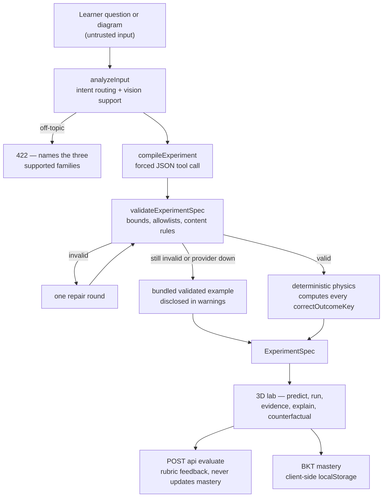

# README proposal (judge-focused)

> Proposed replacement content for the repository README. This file does NOT
> modify `README.md` — the integration owner should adopt it after the final
> merge (the current README predates the renderer contract and lists outdated
> model defaults; see `merge-readiness.md`).
>
> Everything below is verified against `codex/integration-ui` at commit
> `23542fd` unless explicitly marked **[branch-dependent]**.

---

# Counterfactual Lab

**AI tutors explain the world. Counterfactual Lab builds a world you can change.**

## The problem, in 30 seconds

Ask a chatbot "do heavier objects fall faster?" and you get a paragraph. You
read it, you nod, and next week you believe the same wrong thing again —
because nothing ever made your own prediction fail in front of you.

Counterfactual Lab takes any mechanics question — typed or photographed from
a textbook — and compiles it into a live 3D experiment. You must **commit to
a prediction before the world runs**. Then the simulation shows you
synchronized visual and numerical evidence, asks you to explain the result in
your own words, grades that explanation against a rubric, and challenges you
with a one-variable counterfactual ("now let the air interfere"). Your
mastery estimate updates from what you actually demonstrated, not from what
you read.

## Why this is not another chatbot or quiz generator

- **The answer is never handed to you.** The app's landing page promises
  "0 answers handed to you" and means it: you predict, the world answers.
- **The AI never grades its own homework.** The language model proposes the
  experiment's wording and safe parameters; a deterministic physics engine —
  the same one that renders the scene — computes every correct outcome.
- **Being wrong is the product.** The flow is engineered around the
  prediction-error moment that changes mental models, then verifies the
  change with a transfer test in a modified world.

## The learning loop

**Predict → Simulate → Evidence → Explain → Counterfactual**

1. **Predict** — commit to one of three semantically distinct outcomes (with
   a confidence slider) before anything moves.
2. **Simulate** — a real-time 3D scene (React Three Fiber + Rapier) runs the
   experiment.
3. **Evidence** — an evidence notebook records impact times, a synchronized
   chart, and your original prediction side by side.
4. **Explain** — you write what caused the result; a rubric-based evaluator
   returns per-criterion feedback and a hint (`/api/evaluate`).
5. **Counterfactual** — one variable changes (air density, launch angle,
   string length) and you predict again in the changed world. Transfer, not
   repetition.

Bayesian Knowledge Tracing (pInit 0.25, pLearn 0.15, pGuess 0.20, pSlip 0.10
— `src/lib/mastery/bkt.ts`) turns those observations into the mastery meter,
persisted locally in the browser (`src/lib/client/mastery-storage.ts`).

## How AI turns untrusted questions into validated experiments

Learner text and images are treated as **data, never instructions**
(`src/lib/ai/prompts.ts`):

1. `analyzeInput` classifies the question (or diagram, via a vision model)
   into a learning intent; off-topic requests get an honest **422** naming
   the three supported families.
2. `compileExperiment` forces the model through a JSON tool schema to emit a
   declarative `ExperimentSpec` (`src/lib/contracts/experiment.ts`) — scene
   numbers, controls, prediction choices, misconception rubric,
   counterfactuals. No code, no markup, ever.
3. `validateExperimentSpec` (`src/lib/ai/validation.ts`) enforces physics
   bounds, allowlisted scene paths, exactly two drop objects, full outcome
   coverage, one numeric property per counterfactual, and content rules that
   reject executable code, markup, shader source, and file paths.
4. One repair round with concise validator errors; after that, the server
   falls back to a **bundled, pre-validated example** and says so in
   `warnings` with `provenance.source = "validated-example"`.

## Why deterministic physics is the scientific authority

`correctOutcomeKey` — the answer the learner is graded against — is always
**computed and overwritten server-side** by the shared deterministic engine
(`src/lib/physics/deterministic-outcomes.ts`, re-exported by the AI layer),
never taken from the model:

- **Drop**: fall-time comparison; a tie is within 1/30 s (one video frame).
- **Projectile**: landing position vs. a 0.92 m target radius.
- **Pendulum**: period comparison with a 1% tolerance, using a nonlinear,
  damped pendulum model — and the compared change is declared as data
  (`prediction.testChange`), never parsed from the question's wording.

The renderer and the compiler share this one implementation, so what the
learner sees and what the server grades cannot disagree.

## Supported experiment families

| Family | Bundled example | Misconception probed |
| --- | --- | --- |
| Drop (free fall) | The Galileo Drop | "Heavier means faster" |
| Projectile | The Hidden Second Motion | "A forward force must keep acting" |
| Pendulum | The Massless Clock | "A heavier bob swings faster" |

## Architecture



## Safety, privacy, and resilience

- **Prompt injection**: input is sanitized, length-capped, delimited as
  untrusted, and — decisively — every model response is schema-forced and
  fully re-validated. A successful injection can at worst produce an invalid
  spec, which falls back to a bundled example.
- **Content rules**: every spec string rejects control characters, markup,
  code syntax, shader source, and file paths (`src/lib/ai/text-rules.ts`).
- **Images**: PNG/JPEG/WebP only, 4 MB cap, content validation
  (`src/lib/ai/image-validation.ts`); the UI compresses in-browser and
  images are analyzed in memory, never stored.
- **Secrets**: the provider key is read server-side only; `/api/health`
  reports `{ status, aiProviderConfigured }` and nothing else.
- **Fallback**: no API key, provider timeout, provider error, or failed
  repair all degrade to bundled validated examples plus a deterministic
  heuristic rubric — disclosed to the user, never silent.

## Quick start

```bash
npm install
npm run dev          # http://localhost:3000
```

The app is fully usable with **no API key**: the three bundled experiments
run, evidence and grading work (heuristic rubric), and fallbacks are
disclosed in the UI.

To enable live AI compilation, copy `.env.example` and set:

```bash
FEATHERLESS_API_KEY=...        # server-only
# Optional overrides: FEATHERLESS_TEXT_MODEL, FEATHERLESS_VISION_MODEL,
# FEATHERLESS_BASE_URL, FEATHERLESS_TIMEOUT_MS
```

### Offline demo (no provider, no network)

1. `npm run build && npm run start`
2. Open the landing page and click any of the three example cards — they are
   bundled specs and never call the provider.
3. Typing a question also works offline: routing falls back to a
   deterministic keyword heuristic and compilation serves a validated
   example, with the fallback disclosed in the response `warnings`.

## Testing

```bash
npm run lint         # eslint
npm run typecheck    # tsc --noEmit
npm test             # vitest — 188 tests, all provider calls mocked
npm run test:e2e     # Playwright end-to-end lab flow
npm run eval:compiler  # OPT-IN 30-case routing/fallback eval (never in CI)
```

## Current limitations

- Three experiment families (drop, projectile, pendulum); other topics get
  an honest 422, not a hallucinated simulation.
- Mastery persists per-browser (localStorage) — no accounts or classrooms yet.
- Live compile quality depends on the configured Featherless-hosted model;
  the deterministic validator and physics engine are what make its output
  trustworthy.
- Provider-retry and compile-response caching exist on
  `claude/integration-backend` but are **[branch-dependent]** — not yet in
  the integrated app.

## Screenshots

Captured from the real application (production build, offline fixture mode,
1440×900, no edits):

- Landing: [`docs/assets/submission/landing.png`](../assets/submission/landing.png)
- Evidence notebook after a wrong prediction:
  [`docs/assets/submission/evidence.png`](../assets/submission/evidence.png)
- Completed counterfactual (transfer test):
  [`docs/assets/submission/counterfactual-complete.png`](../assets/submission/counterfactual-complete.png)
